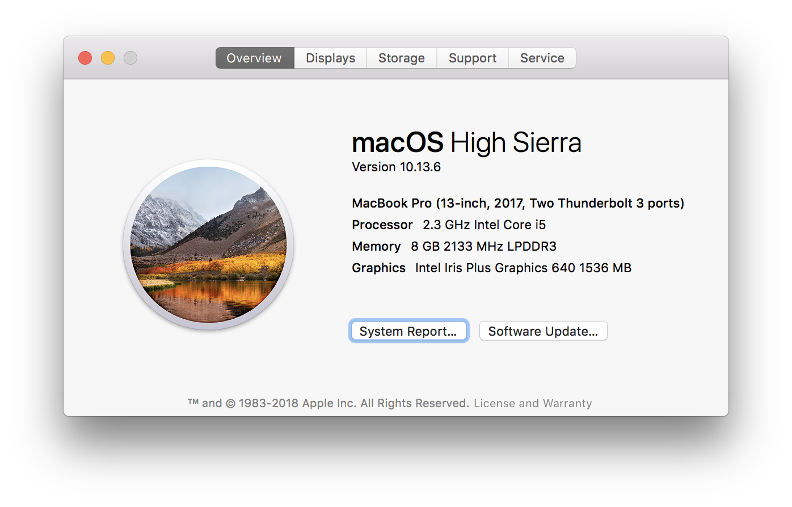
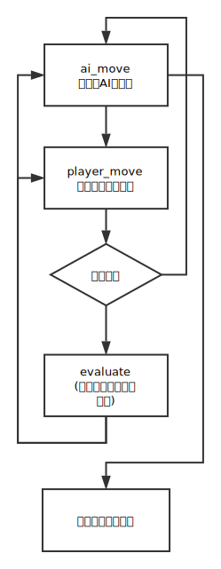
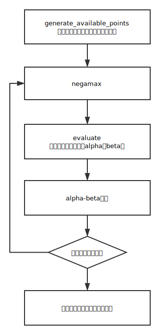

# 基于博弈树Negamax搜索、$\alpha-\beta$剪枝、启发式搜索的井字棋与五子棋AI


[在线试玩 demo](http://cjhahaha.github.io/ai-games/) 


## 相关原理与技术

### 算法

1. 极大极小值搜索算法 Minimax

   ​		极大极小值算法是双人博弈中的常用算法，主要思想是一方要在可选的选项中选择将其优势最大化的选择，另一方则选择令对手优势最小化的方法。具体是实现是对博弈树进行深度优先搜索，评估遍历到的节点的分数，在搜索过程中使自己的分数和对手分数之差最大化，以到达寻找形成**对自己最优、对对手最劣**的走法。

   ​	下面用井字棋的博弈树详细说明。井子棋的搜索树如下图所示。假设人类玩家先手，AI后手，空棋盘是第0层，那么博弈树的偶数层代表人类棋手的落子，奇数层代表AI的落子，搜索的时候，在走到叶子结点时，使**奇数层局面评估与偶数层局面评估之差**最大。

   

   ​	考虑井字棋的最大状态数不超过$9!=362880$，搜索**深度可以不限定**，直到输/赢/平局位置停止，因此评估函数可以设置为：

   $$evaluation(chessboard)=\left\{ \begin{aligned} -1 & , & player \  wins \\ 0 & , & else \\ 1 & , & AI \ wins \end{aligned} \right. \tag{1}$$

   ​	具体代码如下。遍历棋盘找空位，**假设在此处落子**，预测对方落子位置并**获得评估分数**，**回溯**。其中`ai_move`相当于*max*（最大化自己的评估分数）的过程，`player_move`相当于*min*（最小化对方的评估分数）的过程。

   ```js
   const ai_move = (chessboard) => {
       let ret = { score: -INF, best_move: [] }, temp_score;
   
       let win_state = is_about_to_win(chessboard, AI);
       if (win_state.flag === true)                  
           ret = { score: AI, best_move: win_state.best_move };
       else if (is_full(chessboard))
           ret.score = TIE;
       else {
           for (let i = 0; i < 3; i ++)
               for (let j = 0; j < 3; j ++)
                   if (chessboard[i][j] === 0) {
                       // place here
                       chessboard[i][j] = AI;    
                       // predict player move
                       temp_score = player_move(chessboard).score; 
                       // rollback
                       chessboard[i][j] = 0;                                        
   
                       // update score and best move
                       if (temp_score > ret.score) {          
                           ret.score = temp_score;
                           ret.best_move = [i, j];
                       }
                   }
       }
   
       return ret;
   };
   
   
   const player_move = (chessboard) => {                              
       let ret = { score: INF, best_move: [] }, temp_score;
   
       let win_state = is_about_to_win(chessboard, PLAYER);
       if (win_state.flag === true)
           ret = { score: PLAYER, best_move: win_state.best_move };
       else if (is_full(chessboard))     
           ret.score = TIE;
       else {
           for (let i = 0; i < 3; i ++)
               for (let j = 0; j < 3; j ++)
                   if (chessboard[i][j] === 0) {
                       // place here
                       chessboard[i][j] = PLAYER;            
                       // predict AI move
                       temp_score = ai_move(chessboard).score;   
                       // rollback
                       chessboard[i][j] = 0;                                        
   				  
                       // update score and best move
                       if (temp_score < ret.score) {                                
                           ret.score = temp_score;
                           ret.best_move = [i, j];
                       }
                   }
       }
   
       return ret;
   };
   ```

   

2. $\alpha-\beta$ 剪枝算法 Alpha Beta Pruning

   ​	考虑五子棋的棋盘大小，博弈树就很大一棵了，暴搜是不现实的，所以必须剪枝。$\alpha-\beta$剪枝的主要思想是**减少搜索树的分枝**，将搜索时间用在**分差更大**的子树上，继而提升搜索深度。具体实现为：$\alpha$代表已经评估过的己方局面的最大值， $\beta$ 代表已经评估过的对方局面最小值。如果当前在min层且该局面分数大于已经评估过的己方局面的最小值，就没有必要再继续搜索这个节点了，因为显然不是全局最优。如果当前在max层且该局面分数小于已经评估过的己方局面的最大值，同理，也没有必要再继续搜索这个节点了。过程用下图所示。具体代码在negamax算法说明部分给出。

   

   

3. 极大极小值算法的优化 Negamax

    	minimax算法中，对自己评估获得的最大值和对对方评估的最小值，可以简化为

   $$max(a,b) = -min(-a, -b) \tag{2}$$

   ​	即可将博弈树转换为下图这种形式，与minimax并无二致，不过这样方便更新$\alpha-\beta$剪枝中的alpha和bta的值。

   

    	所以我们可以把minimax中的两个函数集合成一个函数。如果是AI执子，则向评估结果大的子树前进；若果是人类执子，则向评估结果小的子树前进。配合 $\alpha-\beta$剪枝使用，代码如下所示。

   ```js
   const _negamax = (role, depth, alpha, beta) => {
   	let e = new Evaluation(g_chessboard);
   	if (depth <= 0 || win_check())
   		return e.evaluate_chessboard(role);
   
   	let search_list = e.generate_available_points(role);
   	for (let i in search_list) {
   		g_search_cnt ++;
   		let x = search_list[i].point[0];
   		let y = search_list[i].point[1];
   
           // place
   		g_chessboard[x][y] = role; 
   		let val = -_negamax(-role, depth - 1, -beta, -alpha);
           // rollback
   		g_chessboard[x][y] = 0; 
   
   		if (val > alpha) {
   			if (depth === max_depth)
   				g_next_move.push([x, y]);
                // alpha beta pruning
   			if (val >= beta) {
   				g_cut_cnt ++;
   				return beta;
   			}
   
   			alpha = val;
   		}
   	}
   
   	return alpha;
   };
   ```

    

4. 启发式搜索 Heuristically Search

   ​	我设置搜索深度是3，即使加入了剪枝，搜索时间还是在10s上下。于是考虑用启发式搜索继续优化。其主要思想是通过指导搜索向最有希望的方向前进，降删除某些状态及其延伸，可以消除组合爆炸，并得到令人能接受的解，不过通常不一定是最优解。根据$\alpha-\beta$剪枝的过程我们可以发现，如果越早找到最大值，能剪的枝越多，所以节点的搜索顺序很重要。对于井子棋，我采用遍历棋盘找空位，对于五子棋可不能这样做了，否则搜到爆栈都搜不出来。具体实现是对棋盘每个点进行打分，**从分高的节点开始搜索**，可以大大减少搜索次数。具体代码见“实验方案与过程”。


### 框架

1. React.js

   使UI组件化，方便快速开发UI界面。

2. Electron

   使用 JavaScript, HTML 和 CSS 构建跨平台的桌面应用。

   

## 实验环境

- 操作系统及硬件配置



- 编程语言：遵守ES6的JavaScript
- UI界面搭建：html5 + css3 + React.js + Electron


## 方案

1. 井字棋AI  Tic-Tac-Toe

    - 算法流程图如下所示

      

      ​		其中，`ai_move`和`player_move`的代码、`evaluate`的公式已在“实验相关原理与技术”的“极大极小值搜索算法”部分给出，此处不再赘述。

   - 项目结构

     ```
     ├── src/TicTacToe
         ├── TicTacToe.css
         ├── TicTacToe.js
         └── minimax.js
     ```

     ​	其中，关键算法包含在`minimax.js`中，

   

2. 五子棋 AI GoBang




